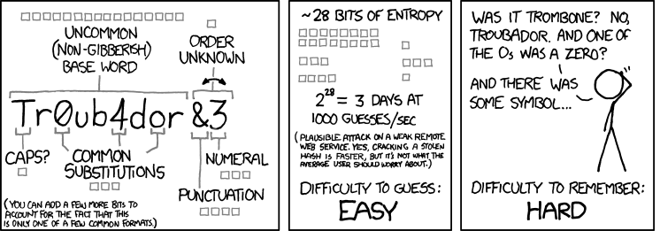
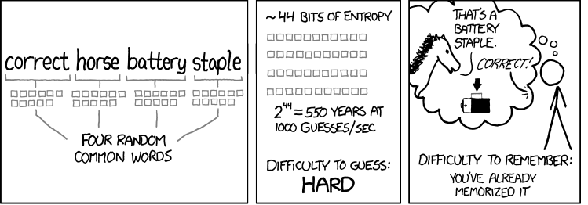
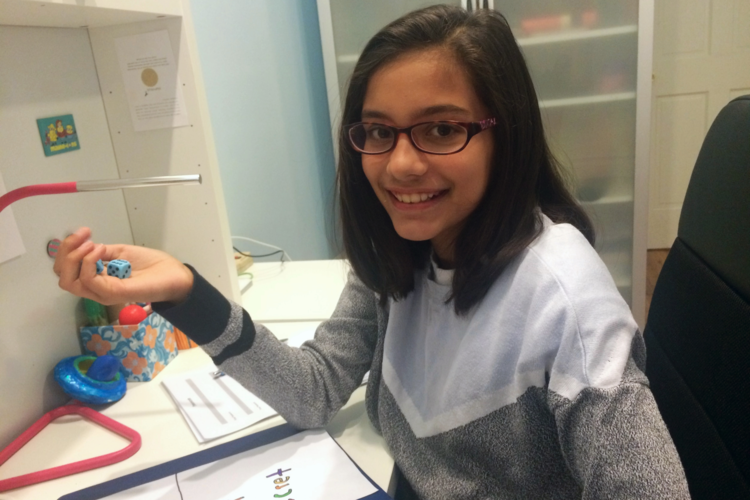

# Passwords
It might be better not to trust ourselves

<!---->
<!-- Creative Commons Attribution-ShareAlike -->

---

<!-- Motivation -->

# making a strong password

there are two approaches

---

# 1. Substitutions
!mansc[890AE?l1%mÎL’JKlakf-012nX

</img>

credit: xkcd

---

# 2. Seven words
Advanced Sixteen Furious Board Drizzle Bell

</img>

credit: xkcd

---

expected to be 
# unbreakable by
  

6 words       - NSA & company **today**

7 words       - Large agencies **~2030**

8 words       - Large agencies **> 2050**

  

source: Diceware.net, Last updated 2017-10-26

---

> I'm Mira Modi. I'm a ninth grader in New York City, and I sell strong, secure passwords. 

---

# "It sounds a little crazy to buy a password."

But using a terrible password, such as 12345 or password, is even crazier

---

# Other tips
* Don't use personal information
* Don't reuse passwords

--- ---

# kinds of attacks
Bruteforce | Dictionary Attacks | Key Loggers

---

# Bruteforce Attack

aaaaaab

aaaaaac

aaaaaad

...

---

# Dictionary Attack

aardvark

aardvarks

aardwolf

aardwolves

Aaren

...

---

# Key Loggers

Malware that logs every single key press

---

# What about biometrics?
(something you are)

---

if a biometric is compromised, you’re done. You can’t get another ear.

-- <cite> Woodrow Hartzog,  Professor of Law </cite>

---

# Multifactor-authentication

Something **you know** + something **you have**

--- ---

Only by having strong passwords,
# Are you safe? 

---

# No!

---

some security 
# doesn't depend
#            on you

---

# even big companies faill
just imagine the rest

---

# Things they can do

password hashing, salting, etc..
[video](https://www.youtube.com/watch?time_continue=342&v=FYfMZx2hy_8)

---

# What can you do to make sure?

Nothing, really. Just hope nothing leaks.

---

# Check if you account has been *compromised*

#### https://haveibeenpwned.com/

---

# Password Managers

It might be better not to trust yourself

---

## introducing

"The _PAPER_ password manager"

---

Yes, depending on your *thread model* paper might work well

---

## Avoid using social logins
(aka. when you login into a website with a social media account)

---

## 2FA
2 Factor Authentication

---

## Change important passwords
every so often

---

# close sessions
when you no longer need them

--- ---

# Closing remarks
What can we take from this?

---

Making and managing good passwords
# is hard

---

# What can help us?

- memorization techniques
- password managers

---

# Thank you

